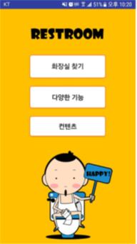
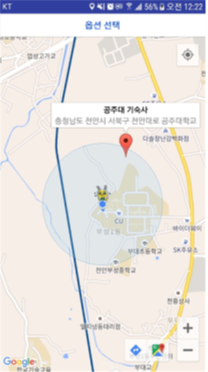

# Daeddongyeojido (안드로이드 프로젝트)

#### 1. 프로젝트 정보

\-   프로젝트명 : 대똥여지도

\-   프로젝트 기간 : 2017. 03 ~ 2017. 06

\-   참여 인원수 : 3명

\-   본인 역할 : 개발 총괄 및 Front-End 개발

\-   프로젝트 설명 : 사용자가 화장실이 정말 급할 때 자기 위치를 기준으로 가장 가까운 화장실의 위치들을 알려주는 어플리케이션 입니다. 공공 데이터를 이용하여 전국에 있는 공공 화장실을 활용하였고 만약 등록이 되어있지 않을 경우 사용자로부터 정보를 얻는 선순환 구조로 개발자와 사용자가 함께 만들어가는 어플리케이션 입니다. 또한 화장실에서 즐길 수 있는 다양한 컨텐츠(동영상, 만화, 인터넷 링크, 에티켓 벨) 등을 제공하고 있습니다.

\-   개발 환경 : **Android Studio**, **Eclipse**, Photoshop

\-   개발 기술 : Android Studio(Java), TCP 통신

\-   성과 : 처음으로 안드로이드의 개념과 개발 기술을 알게 되는 프로젝트였고 또한 전체 프로젝트 중 이때가 가장 갈등이 심하고 팀원 간의 어려운 일들이 많았습니다. 하지만 그동안의 축척된 협업 기술과 문제해결능력을 이용하여 갈등을 해소하였고 또한 어려운 갈등 등을 해결함으로써 협업의 좋은 경험이 되었다고 생각합니다. 앞으로도 다양한 프로젝트를 진행할 때 이런 경험들이 많은 도움이 될 것 같은 생각이 들었습니다.


#### 2. 설치방법

< Front-End >

```
Android import
```

< Back-End>

```
Eclipse Import
```


<center>로딩화면</center>




<center>메인화면</center>




<center>화장실 찾기</center>

